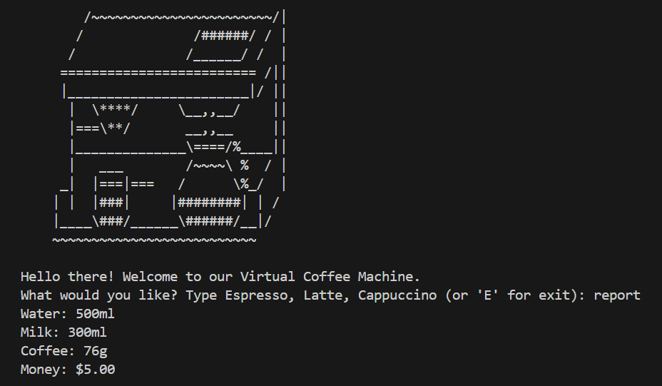
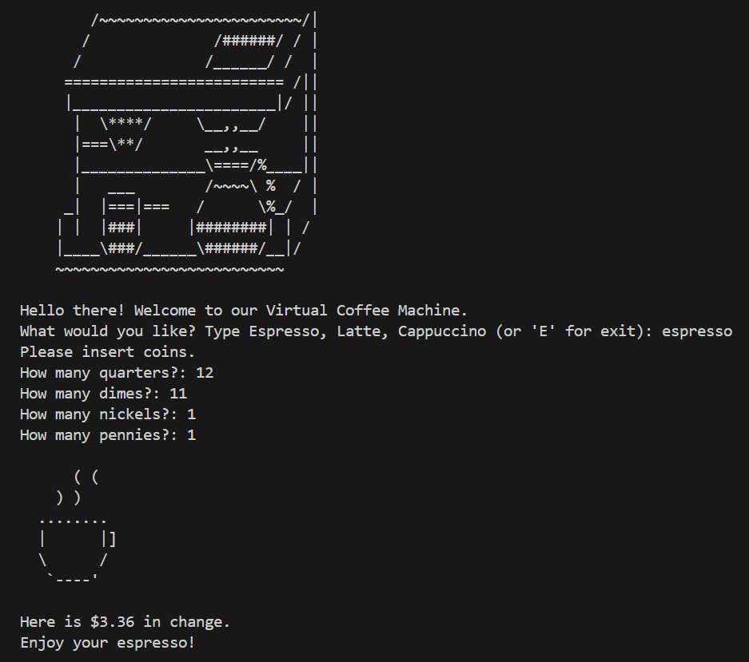

# Virtual Coffee Machine Project

Welcome to the Virtual Coffee Machine Project! This project built with Python simulates a coffee machine, allowing you to select and brew different types of coffee virtually.

## Introduction

The Virtual Coffee Machine project aims to create a simple yet functional coffee machine simulation. It allows users to select from a variety of coffee options, process their choice, and get a virtual "brewed" coffee as output.

## Features

- Multiple coffee options to choose from
- Simulation of brewing process
- Easy-to-use interface
- Payment options
- Checks for ingredients stock in the machine
- Two secret options for maintainers and coworkers:
    - "off" to turn off the machine
    - "report" to show cashflow and ingredients stock

## Example Output
Here's an example of what the output looks like when you brew a coffee:

## Installation

To get started with the Virtual Coffee Machine, follow these steps:

1. Clone the repository.
2. To run the Virtual Coffee Machine, you can use the provided batch file for easier execution:

    Execute the program by running the batch file:

    `Play_Virtual_Coffee_Machine.bat`

    This will launch the coffee machine simulation, and you can start brewing your virtual coffee!

